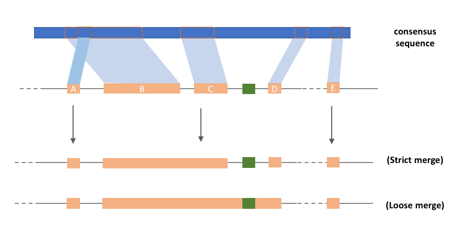
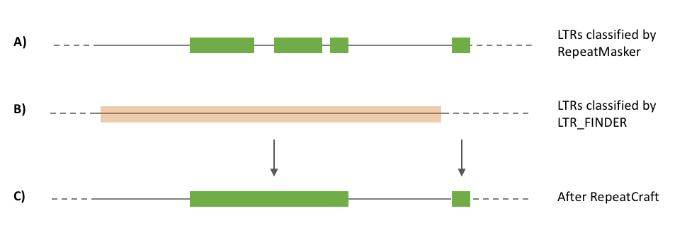
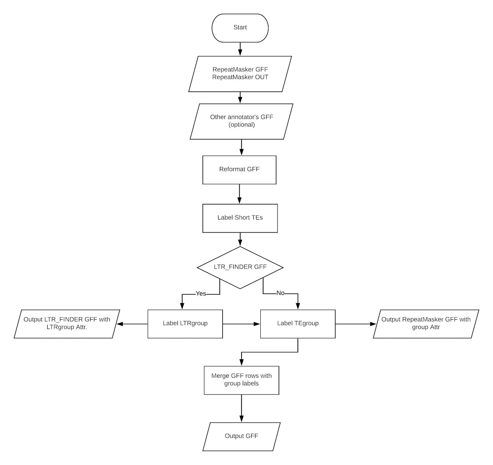
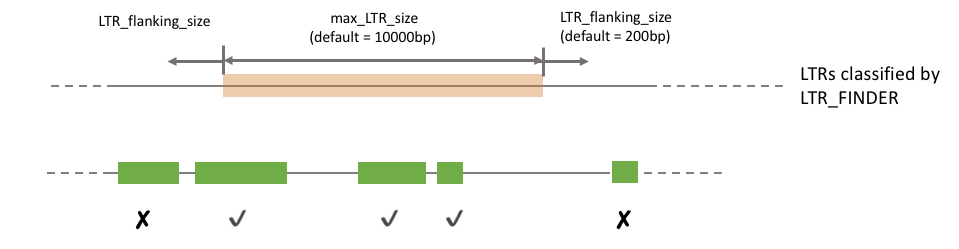

[](https://travis-ci.org/niccw/repeatcraftp)
# RepeatCraft pipeline

#### Introduction
RepeatCraft pipeline incorporates tools for repeat element classification based on both sequence similarity and structural features. The pipeline defragments closely spanced repeat loci in the genomes, reconstructing longer copies thus allowing for a better annotation and sequence comparisons. A Shiny web application is also supplemented as a user interface for the RepeatCraft pipeline, and it allows easy access and interactive study of repeat elements. The web server is available at [http://131.130.65.134:3838/repeatcraft](http://131.130.65.134:3838/repeatcraft). You can also run it on your machine by installing the repeatcraft R package [https://github.com/niccw/repeatCraft](https://github.com/niccw/repeatCraft).

#### What does RepeatCraft do?
##### Merge repeat 'fragments'

After the repeat-based repeat identification and annotation (i.e. RepeatModeler and RepeatMasker (Smit, 2013-2015)), fragments of repeats beloning to the same repeat family can be found in certain genomic regions (for example: blcok b,c,d in track B). These repeats are closely spanced and non-overlap in the consensus sequence. Multiple counting of repeats may affect the result of downstream analysis (e.g. age estimation). Therefore, we develope RepeatCraft as a easy-to-use tool for mering repeat fragments, with flexible parameter setting. Group labels are first added to the attribute field of repeats to be merge, then RepeatCraft merges the repeat based on the TE family label and LTR label (see below). The strict mode only merges consective repeats while loose mode also works on non-executive repeats, the annotation information of other repeats (i.e. simple repeats) between the fragments are not modified.

##### Annotation from LTR_FINDER (optional but highly recommended)

RepeatCraft makes use of the annotation information from LTR_FINDER (Xu and Wang, 2017), a popular structural-based LTR (Long Tandem Repeat) identification tool. It identify the full-length LTR by searching structural features. Using the results from LTR_FINDER, RepeatCraft merges the LTR annotated in the RepeatMasker GFF (which belong to the same LTR subgroup) and further decreases the degree of fragmentization. 

##### Other
Short repeats are also labelled in the early step. Repeats with length less than certain size (default = 100bp, except simple repeats,low complexity, satellite and snRNA; user can define the threshold for each repeat class in **mapfile.tsv**) would have a label of *shortTE=T* in the attribute column. The *shortTE* label are not used in merging repeat fragments, user can study the distribution of short read on the RepeatCraft web application by uploading the output.

###### General workflow of RepeatCraft


***

### Run RepeatCraft
Simply run RepeatCraft by calling **repeatcraft.py** (python >= 3.5), it takes the following arguments and options:
```
usage: repeatcraft.py [-h] [-r RMGFF] [-u RMOUT] [-c CONFIG] [-o OUTPUT]
                      [-m MODE]

RepeatCraft pipeline for improving repeat elements annotation by defragments
closely spanced repeat elements,based on sequence similarity and structural
features from different annotators

optional arguments:
  -h, --help            show this help message and exit
  -r RMGFF, --rmgff RMGFF
                        RepeatMasker GFF
  -u RMOUT, --rmout RMOUT
                        RepeatMasker OUT
  -c CONFIG, --config CONFIG
                        Configuration file
  -o OUTPUT, --output OUTPUT
                        Output file name
  -m MODE, --mode MODE  Merge mode. strict or loose. Default = loose
```
Example run:
`./repeatcraft.py -r example_input.gff -u example_input.out -c repeatcraft.cfg -o example -m strict`

### Run in docker container
**Build image from Dockerfile**

`git clone https://github.com/niccw/repeatcraftp.git && cd repeatcraftp`

`docker build -t repeatcraft:v1 .`

**Run repeatcraft inside docker conatiner**

`docker run --rm -v "PATH_TO_INPUT_FILES":/repeatcraft/run  repeatcraft:v1 ./repeatcraft.py -r run/your_input.gff -u run/your_input.out -c run/your_repeatcraft.cfg -o example -m strict`


#### Inputs
The example folder contains the example inputs **example_input.gff**, **example_input.out** (GFF and OUT files from RepeatMasker), **example_ltrfinder.gff** (LTR_FINDER output in GFF/GTF format), **repeatcraft.cfg** (configuration file) and **mapfile.tsv** (which is used in short TEs labelling) . Currently RepeatCraft only supports GFF generated by RepeatMasker v4.0.7 and v4.0.6. RepeatCraft also works on GFF made by RepeatMasker using custom library generated by RepeatModeler. However, the repeat family names should not contain either space of pipe ("|").
The table output from LTR_FINDER can be converted to GFF using the `cnv_ltrfinder2gff.pl` script from the [DAWGPAWS pipeline](https://github.com/jestill/dawgpaws). 


#### Outputs
RepeatCraft generates 3 outputs:
1) rclabel.gff : This is the reformatted GFF from Repeatmasker (type column is the repeat class but not "similarity"), with labels (TEgroup, LTRgroup) added to the attr. column. The TEs are not merged in this GFF.
2) rmerge.gff : This is the GFF after merging based on the labels in rclabel.gff.
3) summary.txt : This summary file lists the number of TEs (by class) before and after merging. It also shows how many TEs are merged by family (TEgroup) and/or based on information from LTR_FINDER (LTRgroup).

The example outputs (**example.rclabel.gff**, **example.rmerge.gff** and **example.summary.txt** can be found in the example folder)

By default, RepeatCraft is in "loose" merging mode. Repeats are merged based on the labels (TEgroup, LTRgroup) added from the previous steps, and the strand (+/-) will follow the orientation of the fragment with longest consensus overlapping in the group.


#### Parameters in repeatcraft.cfg
Other options can be set in the **repeatcraft.cgf**.
```
# Label short TEs
shortTE_size: 100
mapfile: None

# LTR grouping (based on LTR_FINER result)
ltr_finder_gff: example_ltrfinder.gff
max_LTR_size: 10000
LTR_flanking_size: 200

# TEs grouping
gap_size: 150
```

If **mapfile.tsv** (see example) is missing, a unite size (default = 100 bp) will by applied to all repeat classes. Since certain repeat classes (i.e. SINE) have shorter length compare to others (i.e. LTR or LINE), it is recommend to label different classes using different length threshold.

To incoporate the LTR_FINDER annotation, the path (absolute path is preferable, if relative path is used it should be relative to where the **repeatcraft.py** is in) should be stated in **ltr_finder_gff** field. If no LTR_FINDER annotation is available, specify None in that field. The **max_LTR_size** helps filter out overlapping LTR annotation from LTR_FINDER, and  **LTR_flanking_size** allows shift of LTR annotated by RepeatMasker. The following figure shows how these two parameters work.



Finally, **gap_size** refer to the maximum distance between two constitute repeats to be merged, by default it is 150 bp.
***
#### References
JC Estill and JL Bennetzen. 2009. "The DAWGPAWS pipeline for the annotation of genes and transposable elements in plant genomes." Plant Methods. 5:8

Smit, AFA, Hubley, R & Green, P. RepeatMasker Open-4.0. 2013-2015 <http://www.repeatmasker.org>.

Xu, Z., & Wang, H. (2007). LTR_FINDER: an efficient tool for the prediction of full-length LTR retrotransposons. Nucleic Acids Research, 35(Web Server issue), W265–W268. http://doi.org/10.1093/nar/gkm286

